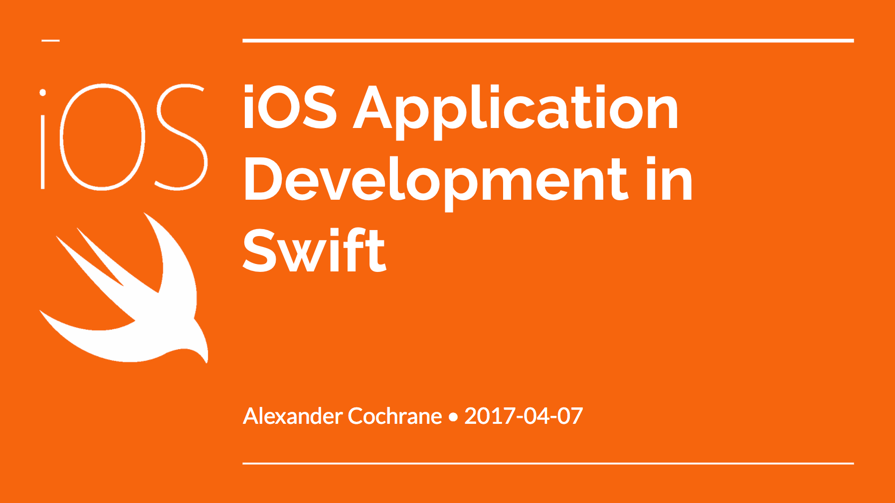
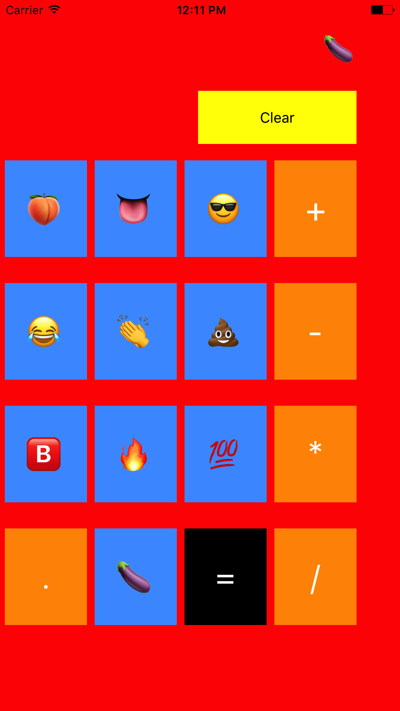

#iOS Application Development in Swift

# 

## Overview

[Swift](http://swift.org) is a general-purpose, multi-paradigm, compiled programming language created as a replacement for [Objective C](https://developer.apple.com/library/content/documentation/Cocoa/Conceptual/ProgrammingWithObjectiveC/Introduction/Introduction.html), which, until Swift's introduction, was the standard for programming on Apple operating systems, including iOS. iOS uses the [Cocoa Touch](https://developer.apple.com/library/content/documentation/General/Conceptual/DevPedia-CocoaCore/Cocoa.html) Framework as its UI Framework.

## Deliverables

{: width="200px"}

